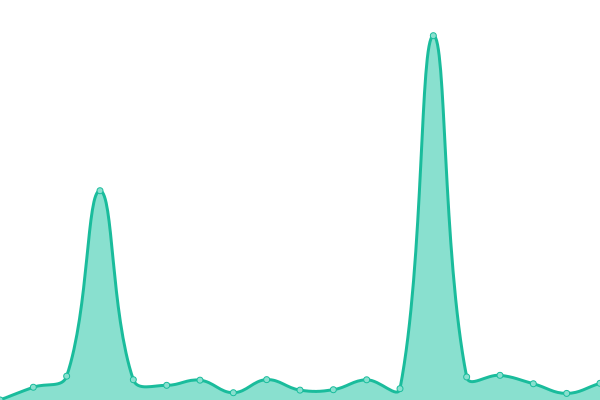
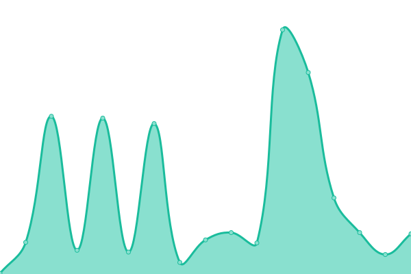
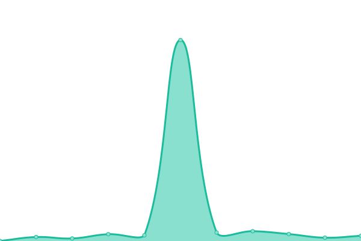
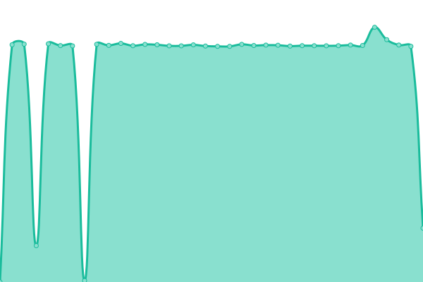

# [📈 Live Status](https://upptime.github.io/upptime): <!--live status--> **🟩 All systems operational**

This repository contains the open-source uptime monitor and status page for [Upptime](https://upptime.js.org), powered by [Upptime](https://github.com/upptime/upptime).

With [Upptime](https://upptime.js.org), you can get your own unlimited and free uptime monitor and status page, powered entirely by a GitHub repository. We use [Issues](https://github.com/upptime/upptime/issues) as incident reports, [Actions](https://github.com/cloudback-staging/status/actions) as uptime monitors, and [Pages](https://upptime.github.io/upptime) for the status page.

<!--start: status pages-->
<!-- This summary is generated by Upptime (https://github.com/upptime/upptime) -->
<!-- Do not edit this manually, your changes will be overwritten -->
<!-- prettier-ignore -->
| URL | Status | History | Response Time | Uptime |
| --- | ------ | ------- | ------------- | ------ |
|  [Cloudback Staging Landing](https://odd-organization-679140.framer.app/) | 🟩 Up | [cloudback-staging-landing.yml](https://github.com/cloudback-staging/status/commits/HEAD/history/cloudback-staging-landing.yml) | 

 432ms
     
 | 

<a href="https://cloudback-staging.github.io/status/history/cloudback-staging-landing">100.00%</a>
    

|  [Cloudback Staging Web](https://app.staging.cloudback.it/health) | 🟩 Up | [cloudback-staging-web.yml](https://github.com/cloudback-staging/status/commits/HEAD/history/cloudback-staging-web.yml) | 

 674ms
     
 | 

<a href="https://cloudback-staging.github.io/status/history/cloudback-staging-web">100.00%</a>
    

|  [Cloudback Staging Identity Server](https://app.staging.cloudback.it/identity/health) | 🟩 Up | [cloudback-staging-identity-server.yml](https://github.com/cloudback-staging/status/commits/HEAD/history/cloudback-staging-identity-server.yml) | 

 32ms
     
 | 

<a href="https://cloudback-staging.github.io/status/history/cloudback-staging-identity-server">100.00%</a>
    

|  [Cloudback Staging Backend Service](https://app.staging.cloudback.it/api/health) | 🟩 Up | [cloudback-staging-backend-service.yml](https://github.com/cloudback-staging/status/commits/HEAD/history/cloudback-staging-backend-service.yml) | 

 291ms
     
 | 

<a href="https://cloudback-staging.github.io/status/history/cloudback-staging-backend-service">100.00%</a>
    

|  [Cloudback Staging Workers](https://app.staging.cloudback.it/health-workers) | 🟩 Up | [cloudback-staging-workers.yml](https://github.com/cloudback-staging/status/commits/HEAD/history/cloudback-staging-workers.yml) | 

 10056ms
     
 | 

<a href="https://cloudback-staging.github.io/status/history/cloudback-staging-workers">100.00%</a>
    

<!--end: status pages-->

[**Visit our status website →**](https://upptime.github.io/upptime)

## 📄 License

- Powered by: [Upptime](https://github.com/upptime/upptime)
- Code: [MIT](./LICENSE) © [Anand Chowdhary](https://anandchowdhary.com), supported by [Pabio](https://pabio.com)
- Data in the `./history` directory: [Open Database License](https://opendatacommons.org/licenses/odbl/1-0/)
